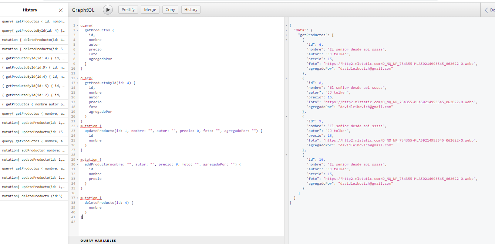

# GRAPHQL EN API

CRUD API de productos usando GraphQL en el controller.

```
Ejecución server:  npm start

```
### GraphiQL



### Estructura de archivos modificada/creada
```
RUTEO
/routes/productos.routes.js

CONTROLADOR
/controllers/productos.graphql.controllers.js
/controllers/graphql/productos.schema.js

```

### Querys y Mutations
```
1) query{
    getProductos {
    id,
    nombre
    autor
    precio
    foto
    agregadoPor
  }
}

2) query{
    getProductoById(id: 4) {
    id,
    nombre
    autor
    precio
    foto
    agregadoPor
  }
}

3) mutation {
   updateProducto(id: 1, nombre: "", autor: "", precio: 0, foto: "", agregadoPor: "") {
    id,
    nombre
    autor
    precio
    foto
    agregadoPor
  }
}

4) mutation {
   addProducto(nombre: "", autor: "", precio: 0, foto: "", agregadoPor: "") {
    id,
    nombre
    autor
    precio
    foto
    agregadoPor
  }
}

5) mutation {
   deleteProducto(id: 4) {
    id,
    nombre
    autor
    precio
    foto
    agregadoPor
  }
}

```