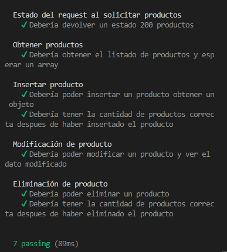

# TESTEAMOS NUESTRA API

Testing realizado con Mocha y Chain.

```
Ejecución server:  npm start

Ejecución Testeo: mocha .\__test\productos.test.js


```
### Resultado



### Estructura de archivos modificada/creada
```

TESTEO
/_test/productos.test.js

RUTEO
/routes/productos.routes.js
/routes/foros.routes.js

CONTROLADOR
/controllers/productos.controllers.js
/controllers/foros.controllers.js

SERVICIO
/services/productos.services.js
/services/foros.services.js

PERSISTENCIA
/daos/productos/factoryPersistence.js
/daos/productos/ [productos.archivo.dao.js, productos.mongodb.dao.js, productos.memoria.dao.js, productos.firebase.dao.js, productos.mysql.dao.js, productos.sqlite3.dao.js, , faker.sqlite3.dao.js]
/daos/models/DaoFaker.js

/daos/foros/factoryPersistence.js
/daos/foros/ [foros.archivo.dao.js, foros.mongodb.dao.js, foros.memoria.dao.js, foros.firebase.dao.js, foros.mysql.dao.js, foros.sqlite3.dao.js]

-----
/daos/models/DaoArchivos.js
/daos/models/DaoMemoria.js
/daos/models/DaoMongoDB.js
/daos/models/DaoMysql.js
/daos/models/DaoMSqlite3.js

DTOs:
/dtos/foros.dto.js

VIEWS:
/public/plantillas/mensajes.hbs

CONFIG
/config/config.js
/config/[firebase.js, mongodb.js, mysql.js, sqlite3.js]
```